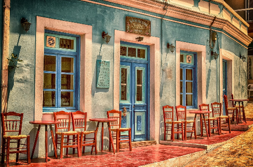
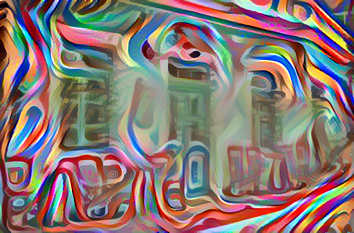
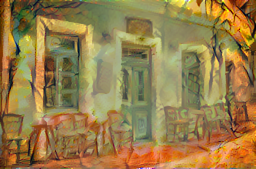

## Style transfer with VGG19 and tensorflow

This is my take at style transfer model. 
I followed the Advanced Tensorflow Techniques specialization and made it 
into simple and easily runnable demo :).
Enjoy!

Below are sample results of the model.

### Stylized cafe

#### Original image:

[//]: # (![]&#40;images/cafe.png?raw=true&#41;)

#### First result of style transfer:

[//]: # (![]&#40;?raw=true&#41;)

#### Second result of style transfer:

